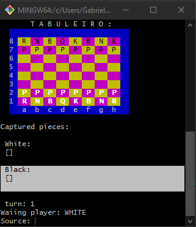

-------------------------------------------------------------

In English:
  
# Project Chess Game
  
Project Chess Game with educational purpose made in Java 11.
  
Finished 01/24/2023 with the participation of Professor Nelio Alves in the Java course
  
  
Runnable jar in [/jar/Chess-Game.jar](https://github.com/DonShell/Sistema-de-Xadrez/tree/main/jar)
  
Use colored terminal to run
  
To run, use the command:
`java - jar Chess-Game.jar`
  

  
  
About the course:

[Java COMPLETO 2023 Programação Orientada a Objetos +Projetos](https://www.udemy.com/course/java-curso-completo/)
  
Professor Nelio Alves
  

-------------------------------------------------------------

Em português:
  
# Projeto Jogo de Xadrez
  
Projeto Jogo de Xadrez com finalidade educacional feito em Java 11.
  
Finalizado em 24/01/2023 com a participação do professor Nélio Alves no curso de Java
  
Jar executável em [/jar/Chess-Game.jar](https://github.com/DonShell/Sistema-de-Xadrez/tree/main/jar)

Use terminal colorido para executar
  
Para executar, use o comando: 
`java - jar Chess-Game.jar`

  
About the course:
  
[Java COMPLETO 2023 Programação Orientada a Objetos +Projetos](https://www.udemy.com/course/java-curso-completo/)
  
Professor Nelio Alves